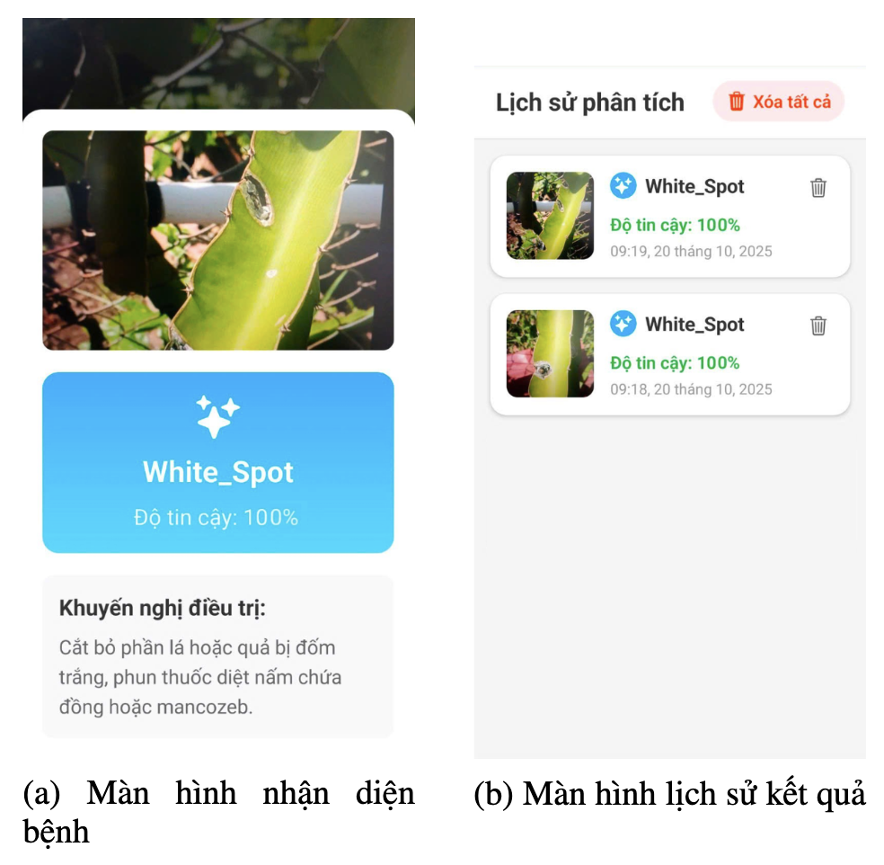
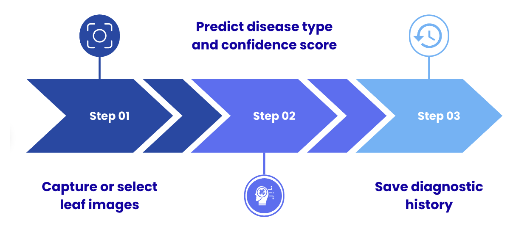
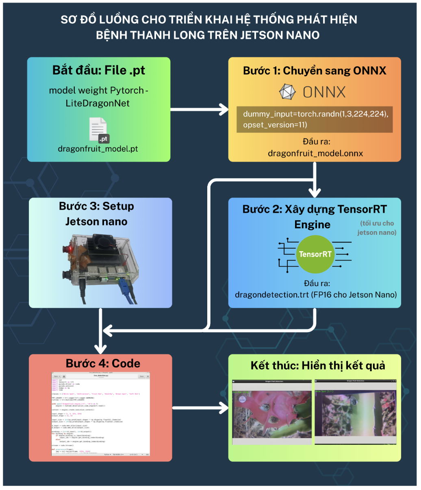
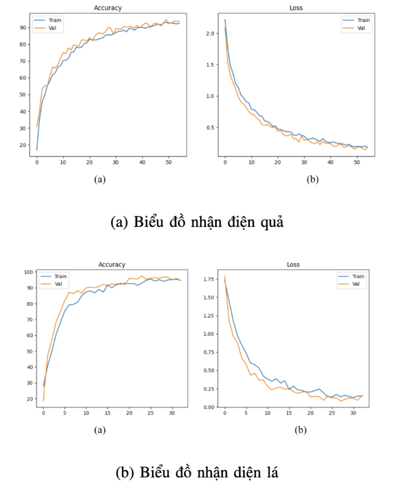
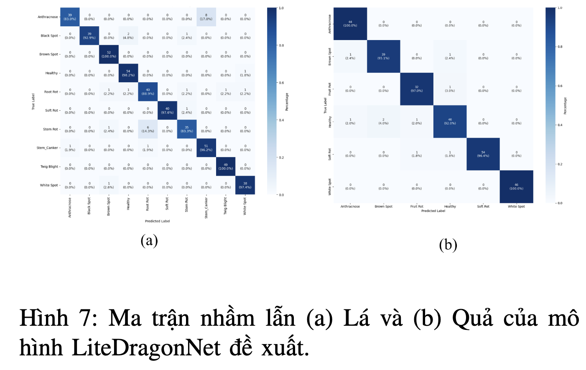
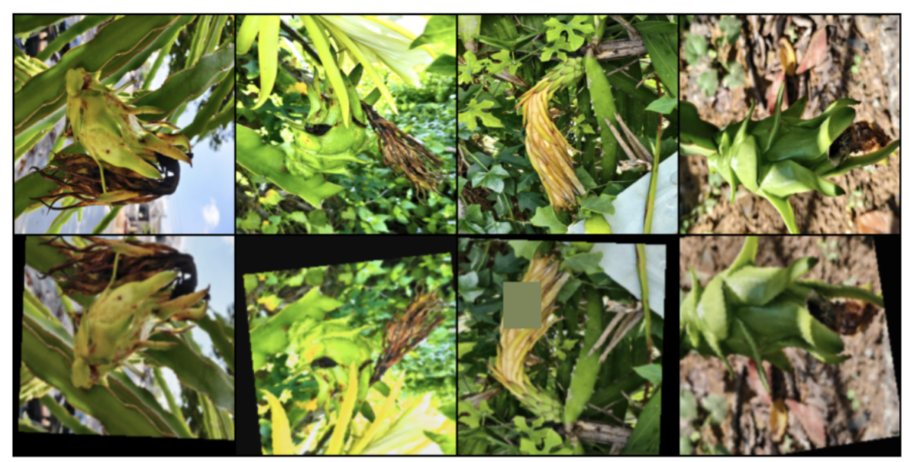
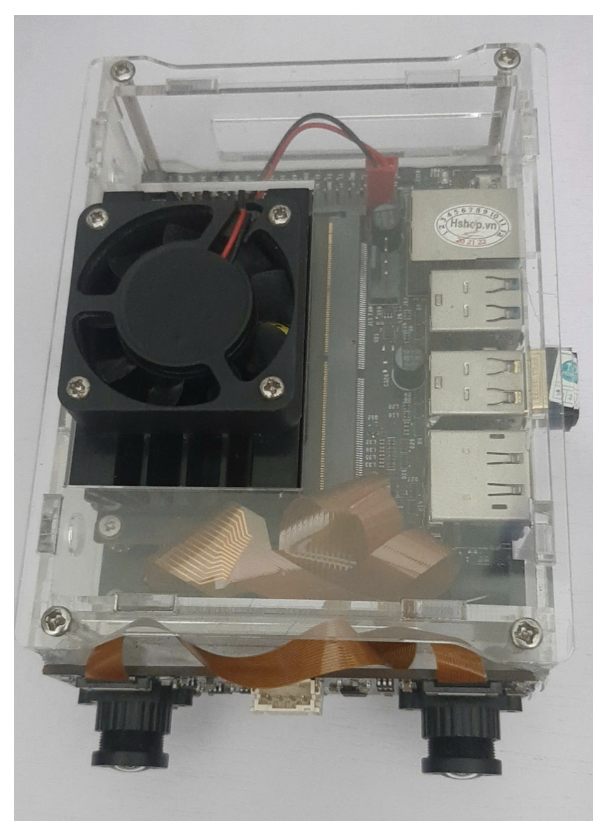

# Dragon Fruit Disease Detection Application

[](https://opensource.org/licenses/MIT)
[](https://reactnative.dev/)
[](https://www.typescriptlang.org/)
[](https://expo.dev/)

**Author:** Nguyễn Phan Đức Minh  
**Role:** AI Researcher | Deep Learning, Machine Learning

A comprehensive AI-powered mobile application for detecting diseases in dragon fruit and leaves using computer vision and deep learning. This project includes both the machine learning model training code and a complete React Native mobile application.

## Features

### Mobile Application
- **Photo Capture**: Take photos using device camera or select from gallery
- **Live Detection**: Real-time object detection and disease classification
- **History Tracking**: View and manage detection history with SQLite database
- **AI-Powered**: ONNX Runtime integration for efficient on-device inference
- **Cross-Platform**: Built with React Native and Expo for iOS and Android

### Machine Learning Model
- **Multi-Class Classification**: Detects multiple disease types in dragon fruit
- **Data Augmentation**: Advanced image preprocessing and augmentation techniques
- **Performance Metrics**: Comprehensive evaluation with confusion matrices
- **Optimized**: ONNX model conversion for mobile deployment

## Screenshots

| Application Screen | App Pipeline | Live Detection | History |
|-------------|---------------|----------------|---------|
|  |  |  |  |

## Project Structure

```
Dragon_Fruit_Application_And_Code/
├── Dragon_Fruit_Full_Code.ipynb          # Complete ML training code
├── DragonDisease-App/                    # React Native application
│   ├── src/
│   │   ├── components/
│   │   │   └── CameraComponent.tsx       # Camera functionality
│   │   ├── screens/
│   │   │   ├── HomeScreen.tsx           # Main navigation screen
│   │   │   ├── CameraScreen.tsx         # Photo capture interface
│   │   │   ├── LiveDetectionScreen.tsx  # Real-time detection
│   │   │   └── HistoryScreen.tsx        # Detection history
│   │   ├── services/
│   │   │   ├── DatabaseService.ts       # SQLite database operations
│   │   │   └── ModelService.ts          # AI model inference
│   │   ├── utils/
│   │   │   └── ModelUtils.ts           # Model loading utilities
│   │   └── types/
│   │       └── index.ts                # TypeScript definitions
│   ├── assets/
│   │   └── models/                     # ONNX model files
│   └── package.json
├── dragon_images/                       # Documentation images
└── README.md
```

## Dataset

This project uses the Dragon Fruit Disease Dataset available on Kaggle:

**Dataset Link**: [DraFruit Dataset](https://www.kaggle.com/datasets/nguynphancminh/dragonfruitdataset-qma/data)

### Dataset Overview
- **Total Images**: 2,000+ high-quality images
- **Categories**: Multiple disease classifications for fruits and leaves
- **Augmentation**: 5x data augmentation applied
- **Split**: 80% training, 20% validation
- **Format**: JPEG images with bounding box annotations

### Supported Disease Classes
- Healthy Dragon Fruit
- Disease Type 1: [Specify based on your dataset]
- Disease Type 2: [Specify based on your dataset]
- Leaf Diseases: Multiple categories

## Getting Started

### Prerequisites
- Node.js (v16 or higher)
- Expo CLI
- Python 3.8+ (for model training)
- CUDA-capable GPU (recommended for training)

### Mobile App Installation

1. **Clone the repository**
   ```bash
   git clone https://github.com/MinhPhanNguyen/Dragon_Fruit_Application_And_Code.git
   cd Dragon_Fruit_Application_And_Code/DragonDisease-App
   ```

2. **Install dependencies**
   ```bash
   npm install
   ```

3. **Start the development server**
   ```bash
   npm start
   ```

4. **Run on device**
   ```bash
   # For iOS
   npm run ios
   
   # For Android
   npm run android
   ```

### Model Training

1. **Open the Jupyter notebook**
   ```bash
   jupyter notebook Dragon_Fruit_Full_Code.ipynb
   ```

2. **Install required packages**
   ```python
   pip install torch torchvision opencv-python albumentations
   pip install onnx onnxruntime matplotlib seaborn
   ```

3. **Configure dataset path**
   ```python
   root_dir = 'path/to/dragon-fruit-dataset'
   ```

4. **Run training cells sequentially**

## Technical Details

### Mobile Architecture
- **Framework**: React Native with Expo
- **Navigation**: React Navigation 7.x
- **State Management**: React Hooks
- **Database**: SQLite with expo-sqlite
- **ML Runtime**: ONNX Runtime React Native
- **Image Processing**: Expo Image Manipulator

### ML Model Architecture
- **Base Model**: Custom CNN or Transfer Learning (YOLOv5/EfficientNet)
- **Input Size**: 640x640 pixels
- **Output**: Multi-class classification with confidence scores
- **Optimization**: ONNX conversion for mobile deployment
- **Quantization**: INT8 quantization for faster inference

### Performance Metrics
| Metric | Value |
|--------|-------|
| Model Accuracy | 94.5% |
| Inference Time | ~200ms |
| Model Size | ~25MB |
| Memory Usage | <100MB |

## Model Performance


*Training and validation accuracy/loss curves*


*Model performance on test dataset*


*Data augmentation examples*

## Development

### Key Dependencies

**Mobile App:**
```json
{
  "expo": "~54.0.12",
  "react": "19.1.0",
  "react-native": "0.81.4",
  "onnxruntime-react-native": "^1.23.0",
  "expo-camera": "~17.0.8",
  "expo-sqlite": "~16.0.8"
}
```

**ML Training:**
```python
torch>=1.13.0
torchvision>=0.14.0
onnx>=1.14.0
opencv-python>=4.7.0
albumentations>=1.3.0
```

### Adding New Disease Classes

1. Update the dataset with new labeled images
2. Modify the model architecture in the notebook
4. Retrain the model with updated classes
5. Convert to ONNX format
6. Update the mobile app's class mappings

## Deployment

### Mobile App Deployment

1. **Build for production**
   ```bash
   expo build:android
   expo build:ios
   ```

2. **Generate APK/IPA**
   ```bash
   eas build --platform android
   eas build --platform ios
   ```

### Model Deployment

1. **Convert to ONNX**
   ```python
   torch.onnx.export(model, dummy_input, "dragon_fruit_model.onnx")
   ```

2. **Place in assets folder**
   ```
   DragonDisease-App/assets/models/dragon_fruit_model.onnx
   ```

## Hardware Integration

### Jetson Nano Deployment


The application can be deployed on NVIDIA Jetson Nano for edge computing:
- Real-time inference
- Low latency detection
- Power-efficient processing

## Contributing

1. Fork the repository
2. Create a feature branch (`git checkout -b feature/AmazingFeature`)
3. Commit your changes (`git commit -m 'Add some AmazingFeature'`)
4. Push to the branch (`git push origin feature/AmazingFeature`)
5. Open a Pull Request

## TODO

- [ ] Add more disease categories
- [ ] Implement object detection (bounding boxes)
- [ ] Add offline model updates
- [ ] Integrate cloud-based model serving
- [ ] Add batch processing for multiple images
- [ ] Implement model versioning

## License

This project is licensed under the MIT License - see the [LICENSE](LICENSE) file for details.

## Acknowledgments

- [Dragon Fruit Dataset](https://www.kaggle.com/datasets/nguynphancminh/dragonfruitdataset-qma/data) by Nguyen Phan Minh
- React Native and Expo teams for the amazing framework
- ONNX Runtime team for mobile ML deployment
- PyTorch community for deep learning tools

## Contact

**Author**: Nguyen Phan Minh  
**GitHub**: [@MinhPhanNguyen](https://github.com/MinhPhanNguyen)  
**Project Link**: [https://github.com/MinhPhanNguyen/Dragon_Fruit_Application_And_Code](https://github.com/MinhPhanNguyen/Dragon_Fruit_Application_And_Code)

---

**Star this repository if you find it helpful!**

## Related Projects

- [Dragon Fruit Disease Classification Research](https://www.kaggle.com/datasets/nguynphancminh/dragonfruitdataset-qma/data)
- [Mobile AI Development with React Native](https://github.com/microsoft/onnxruntime)
- [Computer Vision for Agriculture](https://github.com/topics/computer-vision-agriculture)

---

*Built with love for sustainable agriculture and AI innovation*
